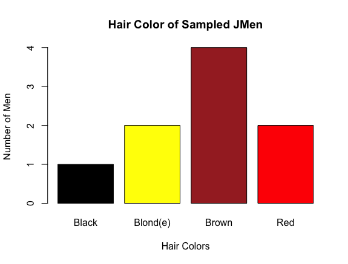

```{r setup, include=FALSE}
knitr::opts_chunk$set(echo = TRUE)
```

## Target Graph



The goal in creating the target graph was to reproduce the graph seen above.

## Data Entry

```{r data, include=TRUE}
jmen <- read.table("jmen.txt", header=TRUE)
jmen
```

## Imitation Graph

```{r graph}
hair_table <- table(jmen$Hair)
barplot(hair_table, col=c("Black","Yellow","Brown","Red"), main="Hair Color of Sampled JMen", xlab="Hair Colors",ylab="Number of Men", names.arg=c("Black","Blond(e)","Brown","Red"))
```

I was able to imitate the target graph well. The scale of the graph is slightly different, as it appears larger. I believe this is due to the sizing of **.png** image being slightly smaller. 